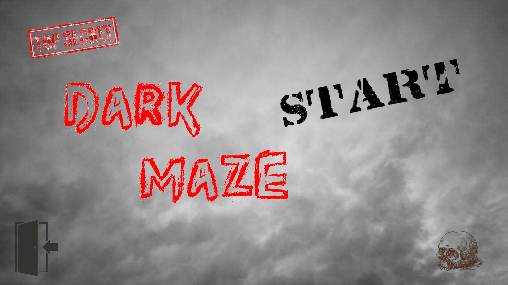
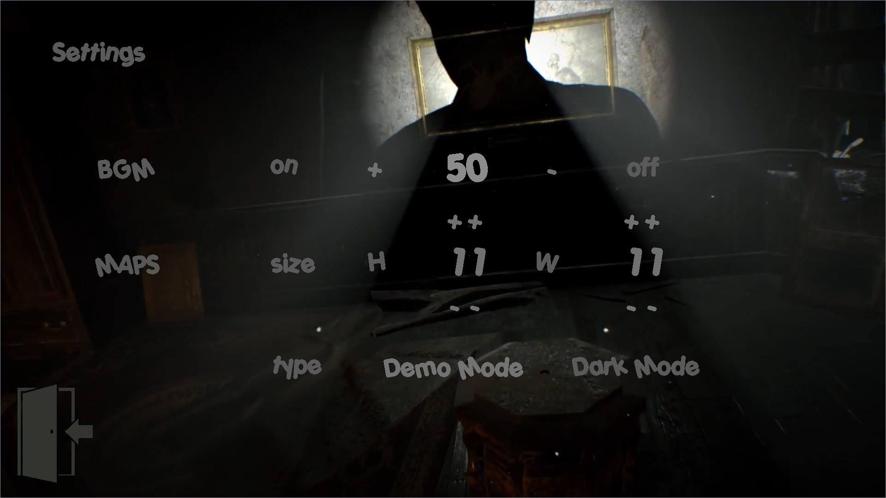
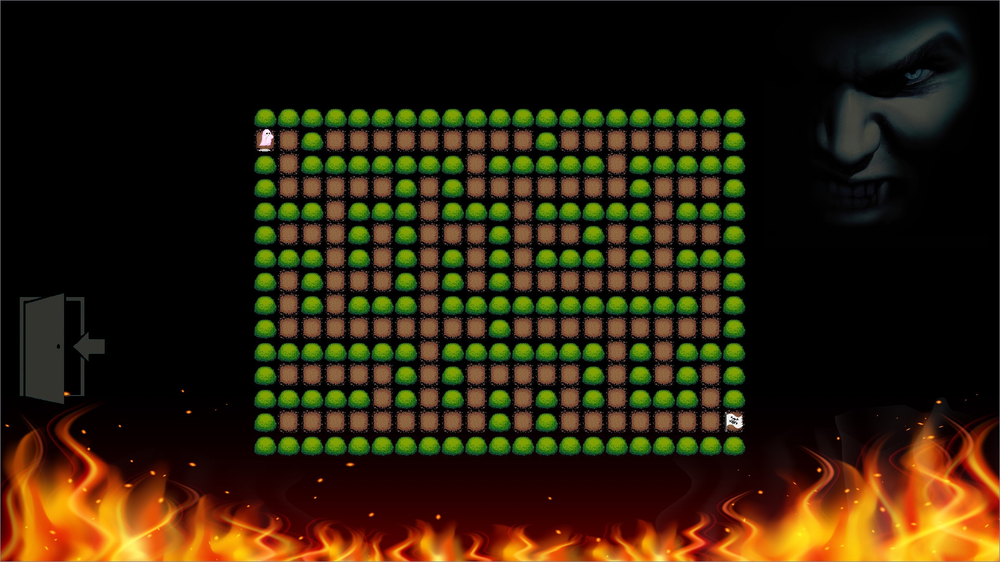

# Dark Maze 1.0
A Maze Game By QT

## 安装

* Dark Maze1.0目录下exe直接运行即可
* 或编译code目录下源码，将resource文件夹复制到编译后exe的同目录（QMediaPlayer库不支持音乐导入资源文件，这里使用的相对目录）

## 展示

游戏加载：

主界面：

设置界面：

游戏界面：

算法演示界面：

## 算法解释

## 迷宫生成算法

基于生成树思想

迷宫高M，宽N

- 步骤

1. 迷宫是矩形的，将其每个格子视为一个点，上下左右视为边，即一张点为M*N，单点(除边)出度为4的图
2. 随机边的权值
3. 跑一边最小生成树
4. 就是这样，如果两个点相连，那么对应的两个格子是通路；如果两个点不想连，那么对应两个格子之间就是一面墙

- 注
  - 最小生成树有Prime和Kruskal，Prime是加点，用优先队列实现；Kruskal是加边，用并查集实现。这里最好用Prime，因为Prime能够从起点出发，获得一个以起点为根的树，并且能够得到每个点对应的父节点
  - 这样生成的迷宫格子与各自之间相邻的墙是一条线，如果想要相邻的墙是另外的格子的话，那么就需要扩大迷宫的长宽，任何相邻点都加上新格子，加上迷宫的边界就变为(2M+1)*(2N+1),这就是为什么本例生成的迷宫边长是奇数

## 寻路算法

- DFS

  递归实现。可以说DFS是最拟合人走迷宫的算法，没遇到一个岔口向一个方向转弯，知道搜到尽头，回来换一个方向继续搜索。

- BFS

  队列实现。每次把点周围相连的新点添加到队列，层层扩展，知道搜索到新点，适合求最短路，但不太适合迷宫寻路。

- 双向BFS

  队列+集合实现。BFS的扩展，BFS是先将起点入队，双向BFS是两个队列，起点和终点开始同时搜索，可以一定程度减少搜索空间，难点在于判断结束条件——两个队列相交，这里使用Set记录终点搜索过的位置，起点队列查找该Set。

  这种算法类似于人玩游戏迷宫时的思想。对于开上帝视角的玩家来说，中等程度的地图，大部分人会选择从终点开始倒着看，找到某一片区域，接着从起点开始正着走，达到这片区域。

- LCA最邻近公共祖先

  这并不是正规寻路算法，而是基于迷宫生成方式的一个快捷路径算法。

  因为本例的迷宫是一棵树，如果以起点为根节点，终点为一个子节点，那么找起点到终点的路径只需从终点向上查找祖先的过程，保存这条路径。如果寻找任意一点到终点的路径，那么先找到该点和终点的最邻近公共祖先，根据树的性质，该公共祖先点一点在起点到终点的路径上。所以路径即为，点->最邻近公共最先->终点。

